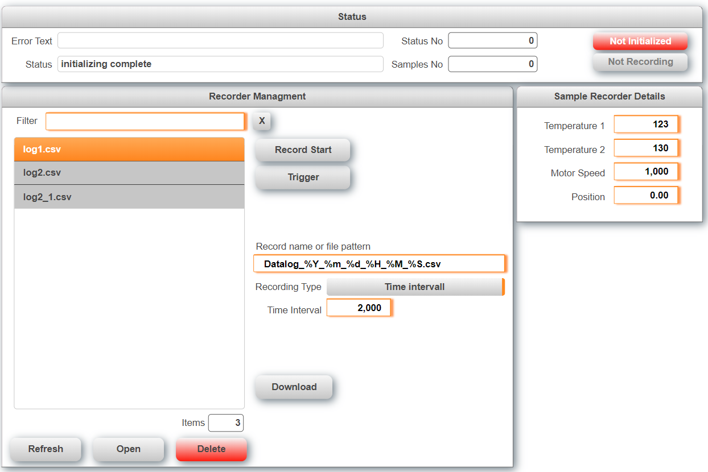

## Table of Contents
* [Introduction](#Introduction)
* [Requirements](#Requirements)
* [Revision History](#Revision-History)

## Introduction
This is a sample project for a data recorder with mappView. It uses B&R mappData to record data and supports up to 3 concurrent web clients.

Also see [**How to import the recorder management into an existing project.**](/Logical/mappRecorder/HowToImport.pdf) Download the latest release from [**here.**](../../releases) When upgrading from a previous version make sure to delete the files that were imported before. Detailed information are available in the [**Wiki**](https://github.com/br-automation-com/mappView-Recorder/wiki). This sample can run in simualtion mode (http://127.0.0.1:81/).

## Requirements
* Automation Studio 4.5
* mappView 5.7.1
* mappServices 5.7.1
* Automation Runtime B4.53

Recommended task class is #8 with a 10ms cycle time.

## Revision History

#### Version 0.1
- First public release

